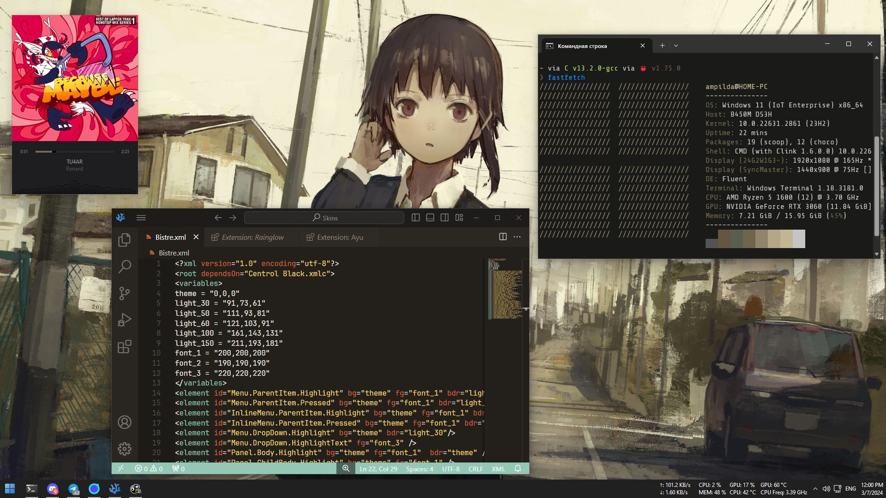

# dotfiles

# General
Terminal - <a href="https://github.com/microsoft/terminal">Windows Terminal</a>  
Package Manager - <a href="https://github.com/microsoft/winget-cli">winget</a>, <a href="https://scoop.sh">scoop</a>  
IDE/Text Editor - in general <a href="https://github.com/focus-editor/focus">focus</a> as GUI text (and .c files) editor, <a href="https://github.com/VSCodium/vscodium">VSCodium</a> as IDE  and <a href="https://github.com/neovim/neovim">NeoVim</a> as a console text editor  
Shell - PowerShell 7 with <a href="https://ohmyposh.dev/">Oh My Posh</a>  
App Runner - <a href="https://github.com/microsoft/PowerToys/wiki/PowerToys-Run-Overview/eef04e3ca7665e727737c6cd951a801daa0b63cc">PowerToys Run</a>  

# Other
Fetch - <a href="https://github.com/fastfetch-cli/fastfetch">fastfetch</a>  
PDF Reader - <a href="https://github.com/sumatrapdfreader/sumatrapdf">SummatraPDF</a>  
Bar - <a href="https://www.startallback.com/">StartAllBack</a>+<a href="https://github.com/zhongyang219/TrafficMonitor/tree/master">TrafficMonitor</a>  
Cursor - <a href="https://7themes.su/stuff/kursory_windows/adwaita/7-1-0-480">Adwaita</a>  
Image Viewer - <a href="https://github.com/sylikc/jpegview">JPEGView</a>  
VideoPlayer - <a href="https://mpv.io/">MPV</a>  
MusicPlayer - <a href="https://getmusicbee.com/">MusicBee</a>

# Themes
VSCodium - <a href="https://open-vsx.org/vscode/item?itemName=daylerees.rainglow">Rainglow(Peel)</a>  
MusicBee - <a href="https://getmusicbee.com/addons/skins/482/centrol-black/">Centrol Black</a>  
Terminal Color Scheme - <a href="https://github.com/scaryrawr/winwal">winwal</a>  
Font in Terminal - <a href="https://github.com/ryanoasis/nerd-fonts/releases/download/v3.1.1/ShareTechMono.zip">ShureTechMono Nerd Font</a>  
Command Prompt - <a href="https://github.com/starship/starship">starship</a>+<a href="https://github.com/chrisant996/clink">clink</a>  
