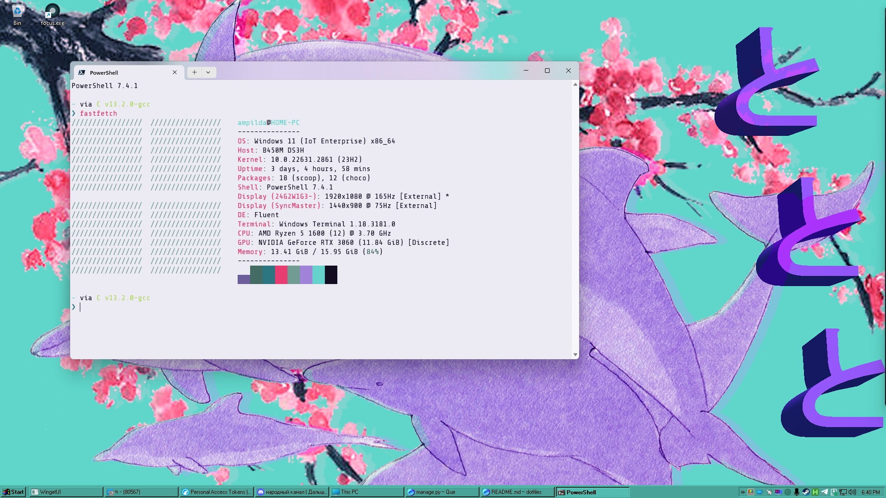

# dotfiles

# General
Terminal - <a href="https://github.com/microsoft/terminal">Windows Terminal</a>  
Package Manager - <a href="https://github.com/microsoft/winget-cli">winget</a>, <a href="https://scoop.sh">scoop</a>  
IDE/Text Editor - in general <a href="https://github.com/focus-editor/focus">focus</a>, sometimes <a href="https://www.jetbrains.com/fleet/">fleet</a>, <a href="https://github.com/NvChad/NvChad">NvChad</a> and <a href="https://github.com/neovim/neovim">NeoVim</a>  
Shell - PowerShell 7 with <a href="https://ohmyposh.dev/">Oh My Posh</a>

# Other
Fetch - <a href="https://github.com/fastfetch-cli/fastfetch">fastfetch</a>  
PDF Reader - <a href="https://github.com/sumatrapdfreader/sumatrapdf">SummatraPDF</a>  
Bar - <a href="https://github.com/dremin/RetroBar">Retrobar</a>  
Cursor - <a href="https://7themes.su/stuff/kursory_windows/adwaita/7-1-0-480">Adwaita</a>  
